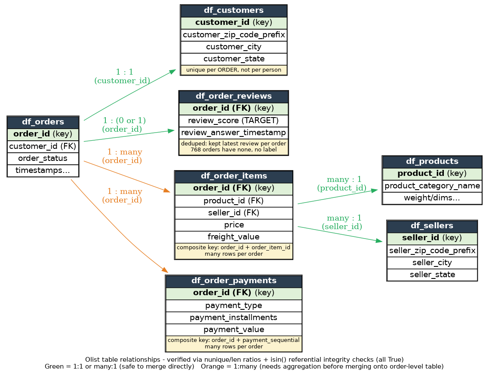

# Rewritten markdown cells — 01_eda.ipynb

Every markdown cell below is rewritten in plain, first-person language. Same ideas, same numbers, same decisions — just simpler wording so it reads like your own notes.

**One change to confirm:** the phase names ("Shape / Quality / Solo / Duo / Group") are gone. Wherever the old text said "flagged for the Duo phase" etc., I replaced it with a plain description of what that step actually is (e.g. "when I compare features against the target"). If you'd rather keep the names, say so and I'll put them back.

Cell numbers match the notebook so you can map each one back.

---

### Cell 0

# Predicting Customer Dissatisfaction Before It's Posted

*Binary review-score classification on 99k Brazilian e-commerce orders (Olist), using only pre-delivery signals.*

**Notebook 1 of a planned series — this one covers the EDA.** The goal is to understand the data well enough to know which features are worth building and where to draw the line between a "good" and "bad" review. Modeling comes in a later notebook.

I work through the data in five passes: check the **shape**, check the **quality**, look at each feature **on its own**, look at each feature **against the target**, then look at the features **together**.

---

### Cell 1

## Problem statement

Predict whether a customer leaves a good or bad review on an Olist order. Binary classification.

- **One row = one order.**
- **Target:** `review_score` (1–5 stars), collapsed into good/bad. I haven't picked the cut-off yet. I'll decide it later in this notebook, once I've seen how the scores are spread out and how they move with the features.
- **What I'm allowed to use:** only things known at or before delivery — delivery lateness, price, freight, product category. Anything that only exists after the customer writes the review is off limits, since the model wouldn't have it at prediction time. That's leakage.
- **Why this target:** my earlier mini-project found that late deliveries lined up with lower scores. This project follows that up properly.

If a step doesn't help predict `review_score` from pre-review data, it's out of scope here.

---

### Cell 2

## Setup

---

### Cell 4

## Understanding the data

Load each table. For each one I check the row and column counts, the data types, and how it joins to the others — which keys link orders to reviews, items, products, and customers.

---

### Cell 5

### Load tables

---

### Cell 7

### Shape, dtypes, nulls

---

### Cell 10

### Preview rows

---

### Cell 12

### How the tables connect (a guess, not yet checked)

This is my working guess at how the tables join. I built it from two clues: columns that share a name across tables, and what the row-count gaps hint at. I haven't verified it yet — that's the job of the quality checks next.

- **orders ↔ customers:** `customer_id` (same column in both).
- **orders ↔ order_items:** `order_id`. Probably one-to-many — order_items has more rows (112,650) than orders (99,441), so `order_id` must repeat. Fits the idea of one order holding several items.
- **orders ↔ order_payments:** `order_id`. Probably one-to-many too — order_payments (103,886) has more rows than orders. Makes sense: one order can be paid in more than one way or in installments.
- **orders ↔ order_reviews:** `order_id`. Row counts are close (99,224 vs 99,441) but not equal either way, so I can't guess the relationship from counts alone. I check this directly below.
- **order_items ↔ products:** `product_id` (same column).
- **order_items ↔ sellers:** `seller_id` (same column).

**Skipping `df_geolocation`.** It's a zip-code → lat/lng lookup, not tied directly to orders or reviews, and the location info I actually need (city/state) is already in the customers and sellers tables. Leaving it out keeps the merge simpler.

---

### Cell 13

### Why I check order_reviews first, before the other quality checks

`review_score` is my target. If its join to orders is broken — missing for some orders, or duplicated for others — and I merge without noticing, one of two bad things happens quietly: I lose labels I need to train on, or I double-count orders. That's a worse problem than a slightly-off feature column, so I verify this one relationship right away, before checking the rest.

---

### Cell 14

### Checking the target join: orders ↔ order_reviews

---

### Cell 18

99,441 − 98,673 = **768 orders have no review at all** → no `review_score` label. These get dropped once merged, since I can't train without a target.

**551 `order_id`s appear on more than one review row.** Before merging, I dedupe `order_reviews` down to one row per order (keeping the most recent by timestamp), otherwise these orders would show up twice in the merged table.

---

### Cell 20

98,673 rows now, which matches the unique-count from earlier. The dedupe worked — one review per order, keeping the most recent `review_answer_timestamp`.

---

### Cell 21

## Data quality checks

Duplicates, whether keys are unique, and whether foreign keys actually match up across tables.

---

### Cell 23

**Full-row duplicate check.** This looks for rows that are identical across *every* column, not just a repeated key. It catches accidental double-loading that a key check alone would miss.

**Result: 0 duplicate rows in every table.** Nothing was loaded twice — clean on this front.

---

### Cell 25

**Uniqueness ratio (unique values ÷ total rows; 1.0 means fully unique):**

- customer_id in customers: 1.0
- order_id in order_items: 0.876
- order_id in order_payments: 0.957
- seller_id in sellers: 1.0
- product_id in products: 1.0
- order_id in order_reviews: 1.0 — confirms the dedupe worked
- order_id in orders: 1.0

This confirms the one-to-many guess for order_items and order_payments (`order_id` repeats in both). customers, sellers, products, reviews, and orders each have a valid single-column primary key.

**Still to check:** this only tells me each key is unique *within* its own table. It doesn't tell me whether every foreign key value actually exists in the parent table — e.g. does every `product_id` in order_items exist in products? That's referential integrity, and I check it next with `.isin()`.

---

### Cell 27

**Referential integrity: all True.**

Every foreign key I checked points to a real row in its parent table, with no orphans:

- orders.customer_id → customers.customer_id
- order_items.order_id → orders.order_id
- order_payments.order_id → orders.order_id
- order_reviews.order_id → orders.order_id
- order_items.product_id → products.product_id
- order_items.seller_id → sellers.seller_id

Together with the uniqueness ratios above, the join map is now verified rather than guessed. Safe to merge.

---

### Cell 28

### Table relationships (verified)

Green edges (1:1 or many:1) can be merged onto `orders` directly. Orange edges (1:many — order_items, order_payments) can't be merged directly without breaking the "one row per order" rule, so I aggregate them to order level first.

---

### Cell 29

## Merging the tables

---

### Cell 30

### Add product and seller details to items

---

### Cell 32

Safe to merge directly. `product_id` and `seller_id` are both many:1 relative to `order_items` (verified above), so the row count doesn't change — still 112,650 rows, just with product and seller columns added.

---

### Cell 33

### Aggregate items up to order level

---

### Cell 35

Row count here is 98,666, not 99,441. This table only has a row for orders that actually had at least one item. That gap shows up as `NaN`s once I merge it onto the full orders table, and I dig into it in the missing-values section below.

---

### Cell 36

### Aggregate payments up to order level

---

### Cell 38

### Build the merged, order-level table

---

### Cell 40

Row count stayed at 99,441, matching `df_orders`. That confirms none of the left joins accidentally multiplied rows — the check I run after every merge.

---

### Cell 41

## Missing values

One look at all the nulls across the merged table, instead of patching each gap the moment it shows up.

---

### Cell 43

**What the null counts say:**

- **768** orders missing `review_id` / `review_score` — no label, can't train on them. Already confirmed this isn't a dedupe artifact; these orders simply never got a review.
- **775** orders missing every item-summary column — no matching row in `order_items` at all. Worth investigating: are these a clear group (e.g. cancelled orders that never shipped), and do they overlap with the 768 missing reviews? **Open — next step.**
- **2,164** missing just `item_mode` — more than the 775 with no items. So some orders *do* have items, but every item is missing its `product_category_name`, leaving the mode with nothing to compute. **Also open.**
- **1** order missing payment data — tiny, but worth a glance to see if it's the same kind of edge case.
- `order_approved_at` (160), `order_delivered_carrier_date` (1,783), `order_delivered_customer_date` (2,965) were already missing in the orders table itself, not caused by any merge. Probably the same not-fully-processed orders as above.
- `review_comment_title` / `review_comment_message` — mostly missing, as expected. Most reviews are just a star rating with no written comment. Free text, out of scope for a first numeric/categorical baseline.

**Next:** look at the `order_status` breakdown for the 775 (and the 2,164), and check the overlap with the 768 missing-review orders, before deciding what to drop.

---

### Cell 47

603 `unavailable` + 164 `canceled` = 767 of the 775 (99%). That confirms the guess: these orders never shipped, so there's nothing in `order_items` for them. The remaining 8 (`created`, `invoiced`, `shipped`) are a small curiosity — orders that got further along but still have no item rows. Not worth chasing for a baseline.

---

### Cell 48

**This is the important one.** `value_counts()` drops `NaN` by default, so I needed `dropna=False` to see the full picture. Two very different groups were hiding inside the 775:

- **19 rows** have no items *and* no review score — no label at all. These are part of the 768 unlabeled orders from earlier, not extra ones.
- **756 rows** have no items but *do* have a review score, and it's heavily skewed: **539 of 756 (71%) are 1-star.** This matches the `order_status` finding — customers whose orders were cancelled or never arrived rated them terribly.

This matters for the drop decision. The 756 aren't just broken rows — they're some of the most strongly labeled data in the whole set. Dropping them just because a merge left gaps would throw away real signal.

---

### Cell 49

The one order missing payment data is also 1-star, matching the same failed-order pattern. With n=1 it doesn't need its own flag column — it just needs to not stay `NaN`.

---

### Cell 50

### Decision: how I handle the gaps

1. **Drop rows where `review_score` is null** — 768 rows (this already includes the 19 above, not extra). No label, can't train on them.
2. **For the rest,** fill the item-summary numeric columns (`total_items_value`, `total_freight`, `num_items`, `num_unique_products`, `num_unique_sellers`, `total_weight_g`) with `0`, fill `item_mode` with `"unknown"` (it's categorical, so `0` doesn't apply), and add a `has_items` flag so the model can tell "genuinely zero" apart from "unknown."
3. **Same for the payment columns** (`total_payment_value`, `payment_type_mode`, `max_payment_installments`) — just 1 row, no flag needed.

*(Code below.)*

---

### Cell 53

### Dropping out-of-scope columns

`review_comment_title` / `review_comment_message` were already flagged as out of scope in the missing-values step — free text, not part of a first numeric/categorical baseline. I drop them now rather than leave mostly-empty columns sitting in `df_clean`.

---

### Cell 55

### Leaving the date nulls alone for now

Still missing: `order_approved_at` (155), `order_delivered_carrier_date` (1,746), `order_delivered_customer_date` (2,843).

I'm not filling these yet, for two reasons.

Nothing uses them yet. I haven't built a feature from these dates, so nothing downstream breaks if they stay empty. Histograms and `.describe()` skip nulls anyway.

Filling them could hide a real signal. A missing delivered date probably means the order never arrived — and I found earlier that those orders are mostly 1-star. If I fill in some default date, that signal disappears before I ever use it.

I'll revisit this when I build the delivery-days feature.

---

### Cell 56

## Looking at features one at a time

The target (`review_score`) and each candidate feature on its own. Checklist so I can track progress instead of holding it in my head.

**Numeric (ready now):**
- [ ] `total_items_value`
- [ ] `total_freight`
- [ ] `num_items`
- [ ] `num_unique_products`
- [ ] `num_unique_sellers`
- [ ] `total_weight_g`
- [ ] `total_payment_value`
- [ ] `max_payment_installments`

**Categorical (ready now):**
- [ ] `item_mode`
- [ ] `payment_type_mode`
- [ ] `customer_state`
- [ ] `has_items`

**Needs feature engineering first:** the five date columns (`order_purchase_timestamp` through `order_estimated_delivery_date`) aren't features yet — they need to become something like `delivery_days` or `delivery_lateness` first. That's a bigger step, not a quick look.

**Out of scope for modeling:** `order_status` (only known after the fact — leakage), `review_creation_date` / `review_answer_timestamp` (post-review — leakage), `customer_city` (too granular; `customer_state` already covers geography).

---

### Cell 58

1-star reviews (11.5%) outnumber both 2-star (3.2%) and 3-star (8.2%). So the distribution doesn't slope smoothly from 5 down to 1 — it dips in the middle and spikes again at the bottom.

This is a known pattern in review data called **extreme response bias** (the shape is sometimes called J-shaped). People with a so-so experience rarely bother writing a review, while people who are either delighted or angry usually do. Reviewers are a self-selected group skewed toward the extremes, not a random sample of customers.

**Why this matters for the cut-off:** a naive "4-5 = good, 1-3 = bad" split lumps 1, 2, and 3 stars into one "bad" bucket. But 1-star reviewers might be a genuinely different, more extreme kind of unhappy than 2- or 3-star ones. Worth re-checking when I set the cut-off later — flagged, not resolved.

---

### Cell 59

### `total_items_value`

---

### Cell 61

**The plot is useless as-is.** Almost all 98,673 rows fall in the very first bin, with a long flat tail out to the max (R$13,440). Equal-width bins cut the *full range* into equal slices, so when a few extreme values stretch that range, the normal orders get crushed into one bar. The plot is technically correct but tells me nothing about a typical order.

---

### Cell 64

On a log scale the shape appears and looks roughly bell-shaped — a **log-normal** distribution. That's common for price-like data, where values come from things multiplying together (like percentage markups compounding) rather than adding.

`describe()` agrees: the mean (136.48) sits well above the median (85), which fits the right skew I saw before the log transform. The picture and the numbers point the same way, which is a nice sanity check.

**Still open:** whether the max (R$13,440) and other high values are genuine big orders or data errors. Not deleting anything yet — that needs a boxplot or a domain check, not just "it looks big."

---

### Cell 65

### Remaining numeric features (quick scan)

Instead of the full deep-dive (histogram + log scale + `describe()` + writeup) on every column, I scan them together first and only stop to dig in on anything surprising or tied directly to the problem (delivery lateness → review score).

---

### Cell 67

Most of these share the same heavy right-skew I already saw in `total_items_value` — expected, since freight, weight, and payment value are all driven by order size.

**One thing worth noting:** `num_unique_products` and `num_unique_sellers` pile up at 1 because most orders have close to 1 item. This isn't a loose pattern — it's a hard limit: you can't have more distinct products than items you bought, so these two can never exceed `num_items`. Worth remembering for when I look at features together — they may add little beyond `num_items`, so they're a multicollinearity candidate to check later.

---

### Cell 68

### Categorical features

Same tools as the target: `value_counts()` plus a bar chart. One thing to watch: `has_items` is binary, but `item_mode` and `customer_state` have many categories, where a plain bar chart gets hard to read. So I pick an approach per column instead of reusing the same code blindly.

---

### Cell 69

### `item_mode`

---

### Cell 73

`other` is the single tallest bar (~17,000). No individual rare category is large, but the long tail combined outweighs every named category. That shows how fragmented the category space is, and it's why I'll use a "top-N + other" approach for modeling instead of one-hot encoding all 74 raw categories.

`unknown` (2,164 orders, ~2%) is my own missing-data placeholder, not a real category — and it's not one clean group. From the missing-values work earlier, it holds two different populations: orders with no items at all (which skewed heavily 1-star), and orders that had real items but every one was missing its `product_category_name`. Small enough to leave as one placeholder for now — **worth revisiting later:** if the no-items part drives the same 1-star signal, I should split it out before modeling.

---

### Cell 74

### `payment_type_mode`

---

### Cell 76

`credit_card` dominates (76.6%), then `boleto` (19.9%); `debit_card` (1.5%) and `voucher` (2.0%) are minor. `not_defined` and `unknown` together are only ~4 rows out of 98,673 — negligible, ignored for the baseline.

Boleto (a Brazilian bank slip, usually paid as one lump sum) versus credit card (often split into installments in Brazil) is a plausible reason for the split — but I haven't checked it against `max_payment_installments`. Leaving it as an open thought, not a confirmed finding.

---

### Cell 77

### `customer_state`

---

### Cell 80

`SP`, `RJ`, and `MG` together make up ~67% of all orders (SP alone is 42%) — no surprise, they're Brazil's most populous and economically dominant states. The other 24 states form a long tail, several under 1% (e.g. `AC`, `AP`, `RR`).

**Hypothesis, not yet tested:** customers in distant, low-volume states may get worse delivery outcomes than those in SP/RJ/MG, if sellers cluster near the big population centers. I can test this once `delivery_days` exists — group lateness and review score by state. **Flagged for later.**

**Backlog, not now:** `seller_state` isn't in `df_clean` (it dropped out during the item aggregation), so I'd need to add it back to actually test buyer-seller distance. I also considered a map but parked it — it would mean bringing back `df_geolocation` (left out earlier) for a visual a bar chart already handles.

---

### Cell 81

### `has_items`

---

### Cell 83

`has_items` is very imbalanced — 756 of 98,673 orders (~0.77%) have no matching row in `order_items` at all, matching the count from the missing-values work. Not new information, but a useful check that the flag column I built during cleanup behaves as expected.

I already found this small group skews heavily 1-star (71%), so it's worth carrying `has_items` forward as a candidate feature — the split is extreme, but the signal inside it is strong.

---

### Cell 84

## Features vs. the target

Each candidate feature against `review_score`. This is what I use to pick the cut-off (which stars count as good vs. bad).

---

### Cell 86

## Checking for redundant features

Before feature engineering, check whether the surviving features overlap with each other.

---

### Cell 88

## Findings summary

- Cut-off between good and bad:
- Features to carry into 02_preprocessing:
- Data quality issues to handle: